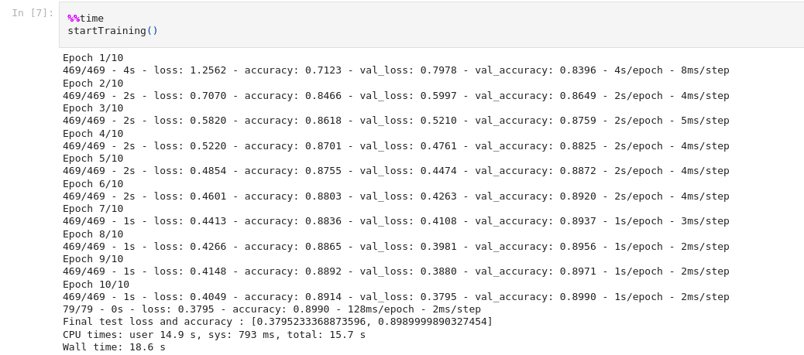

`Time taken in sequential processing: 18.6 sec`
 
 
 
 

 
 

`Time taken in parallel processing: 9.4 sec`
 
 
 
 

 
 

We setup tensorflow to use single core in sequential processing using this piece of code
 
 
 

 
 
 

[parallel processing script](./PDC_lab7_parallel.ipynb)
 
 
 
 

[sequential processing script](./PDC_lab7_sequential.ipynb)

